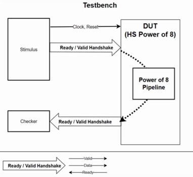

## 1. Handshake Buffer

<table>
<tr>
 <td align="left"></td>
 <td align="right">
</td>
</tr>
</table>

- **Prefix s, m**은 **DUT의 입장에서** 들이거나(slave) 내보내는(master) 신호를 표현한 것임
- **s_ready(ce) = ~m_valid | m_ready**
  - **HS-Shift-Reg**는 M/S를 연결하는 파이프
  - **m_valid가 0**이면 파이프가 전부 비었다는 뜻이므로 파이프에 새로운 값을 넣을 수 있음
  - **m_ready가 1**이면 파이프에서 값이 빠져나가기 때문에 새로운 값을 넣을 수 있음
- **i_hs = s_ready & s_vaild**
  - **Stimulus**는 **i_hs**에서만 값을 **Write**
- **m_hs = m_ready & m_valid**
  - **Checker**는 **o_hs**에서만 값을 **Read**

## 2. Skid Buffer
