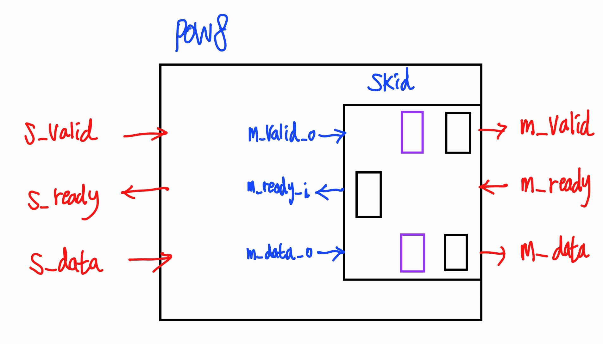

## 1. Handshake Buffer

<table>
<tr>
 <td align="left"></td>
 <td align="right">
</td>
</tr>
</table>

- **Prefix s, m**은 **DUT의 입장에서** 들이거나(slave) 내보내는(master) 신호를 표현한 것임
- **s_ready(ce) = ~m_valid | m_ready**
  - **HS-Shift-Reg**는 M/S를 연결하는 파이프
  - **m_valid가 0**이면 파이프가 전부 비었다는 뜻이므로 파이프에 새로운 값을 넣을 수 있음
  - **m_ready가 1**이면 파이프에서 값이 빠져나가기 때문에 새로운 값을 넣을 수 있음
- **i_hs = s_ready & s_vaild**
  - **Stimulus**는 **i_hs**에서 **Write**
- **m_hs = m_ready & m_valid**
  - **Checker**는 **o_hs**에서 **Read**

## 2. Skid Buffer

> Registerd I/O와 Combinational I/O가 하나의 채널로 들어오는 경우에 대한 타이밍 문제를 어떻게 해결할 것인가?

<table>
<tr>
 <td align="right"></td>
 <td align="right"></td>
</tr>
</table>

- Handshake Buffer가 Cascade 되는 경우 OR-Gate에 의해 타이밍 위반이 발생하므로, 이를 방지하기 위해 버퍼를 삽입함

<table>
<tr>
 <td align="right"></td>
  <td align="left"></td>
</tr>
</table>

- **ready = ~m_valid | m_ready**
- ready는 Combinational Input인 반면, **m_valid_o, m_data_o는 registered Output**이므로 **~ready 직전의 출력이 유실되는 문제가 발생함**
- 이 문제를 해결하기 위해 **Skid(보라색 F/F)** 도입
- **Skid**는 ~ready(LOW) 상태에서만 활성화되는 **Pipe-Through 레지스터**로, ~ready(LOW) 가 지속되는 한 이전 데이터를 Skid에 저장하고 **Pipe Stall**; 이후, ready가 HIGH로 변하면 **SKID -> PIPE** 로 상태를 전이하면서 데이터를 넘김

## 3. I/F 장단점

- **Ready-Vaild I/F**는 가장 많은 AREA를 지불해야 하지만, No I/F 및 Valid I/F와 호환 가능하며, **무손실 데이터 전송**의 이점으로 인해 널리 사용됨
- Ready-Valid I/F와 호환하기 위해 **No I/F**는 Ready/Valid를 1로 Tie, **Valid I/F**는 Ready를 1로 Tie하여 사용함
