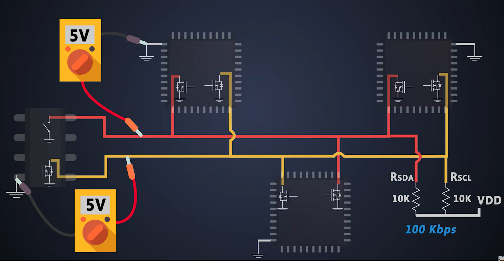
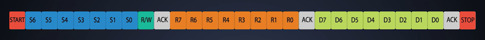

## I2C (Inter-Integrated Circuit)

> I2C의 2는 2-Wire(SDA, SCL)을 쓴다는 뜻이기도 함

### 특징

- Multi-Master : Multi-Slave 통신 지원
- 반이중방식(Half-Duplex)
- **Vdd에 Pull-up 저항이 연결된 Wired-AND 구조**
- 매 Packet 끝에 **ACK**로 수신양호 확인; **NACK**이면 전송을 중단하거나 재시작
- **< SDA: 모델, SCL: 사진사 >**
  - SCL이 LOW 일때만 SDA 변경 (모델이 포즈를 변경)
  - posedge-SCL에서 SDA 읽기 (사진사가 셔터를 누름)

### 비트프레임

**1. Start**

- SCL이 HIGH일 때 SDA가 HIGH->LOW로 떨어지면서 Start
- 이후, SCL이 HIGH -> LOW로 떨어지며 뛰기 시작

**2. BitSeq1: { Sel_addr, R/W, ACK }**

- Sel_addr로 통신할 Slave를 선택
- R/W 모드 선택
- 데이터 패킷은 MSB -> LSB 순으로 전송

**3. BitSeq2: { Reg_addr, ACK }**

- Slave 내부 R/W 할 레지스터 선택

**4. BitSeq3: { Data, ACK }**

- 통신의 목적인 PayLoad
- 복수의 패킷을 보낼 수 있으며, 스루풋은 패킷의 수에 비례함

**5. Stop**

- SCL이 HIGH로 간 뒤, SDA가 HIGH로 가면서 Stop

### Master의 Posedge 확인 의무

#### 1. SDA

- **목적: 버스 소유권 중재**
- SCL-Posedge에서 Bus-State와 비교
- LOW이면 버스 소유권 포기 (High-Z)
- **Arbitaration: 마스터들이 전송한 bit와 버스에서 읽히는 bit를 비교**
  - A: 0001010, B: 0000101, C: 0000111
  - 3th-CLK까지는 0으로 같음
  - 4th-CLK에서 A 탈락 **(&100b = 0; 불일치)**
    - 탈락한 마스터는 SDA/SCL를 Open(High-Z)하여 스스로를 입력 모드로 만듦 (버스 소유권 포기)
  - 6th-CLK에서 C 탈락 **(&101b = 0; 불일치)**
  - B가 버스 소유
  - B의 STOP 신호 감지 이후 A,C가 버스를 두고 재경합
  - **결과적으로 더 작은 주소 Slave 우선** (B -> C -> A)

#### 2. SCL

- **목적: Slave와의 타이밍 동기화 (Clock Stretching)**
- Slave가 Master의 속도를 따라잡지 못하여 **SCL을 LOW로 내리는 것**이 Not-Ready 신호
- **마스터의 SCL-Posedge에서 버스-SCLK과 비교**; LOW에서 버스 Stall
- **I2C의 주요 한계**
  - AHB의 HSPLIT과 달리, **BottleNeck-Slave에 대한 해법이 따로없음**
  - 2-wire과 구현의 간단함을 취하고 고성능을 포기 (trade-off)
