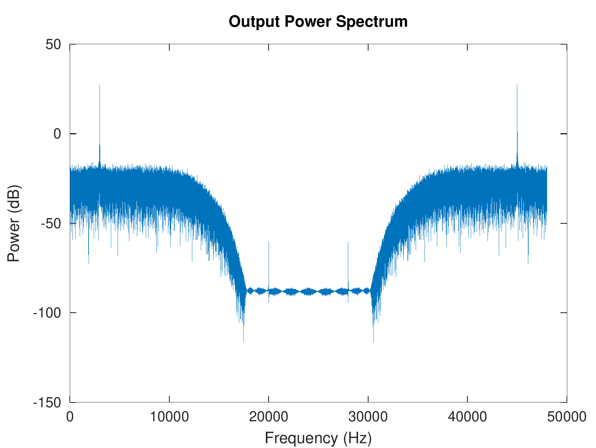
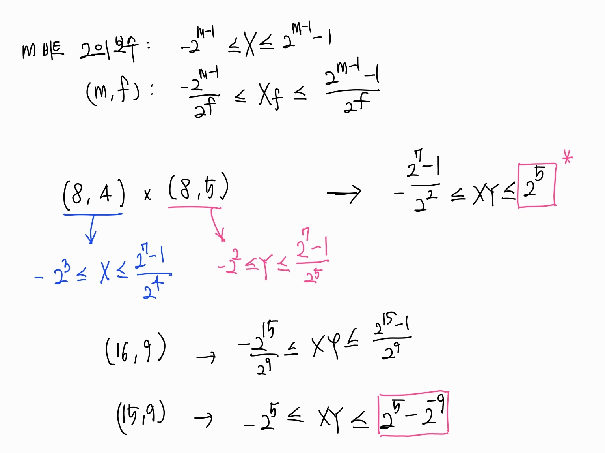

## 컨볼루션

- 시간차 입력과 커널의 MAC 연산
- 유사도를 출력 (패턴인식 관점)
- 원하는 주파수 성분만 filtering (DSP 관점)
  - LPF: 노이즈 제거(blur)
  - HPF: 엣지 검출(변화 강조)

### 1D-Filter 구현

- 길이 L인 커널 h[k] (L-tap Kernel; 시스템의 Impulse Response)
- 현재 입력과 이전 N-1 개의 입력을 저장하는 배열 x[n-k]
- Σ h(k)*x(n-k); [k = 0 ~ N-1] : MAC 연산
- [1D-Filter.c](./filter.c)

### 검증 (Octave)
- output.txt 파일을 gnu-octave를 사용하여 검증
- [spectrum.m](./spectrum.m)

### Fixed-Point로 구현

##### Fixed-Point MAC의 범위
- **곱셈**: (m1, f1) * (m2, f2) 
  - 대칭 포화를 가정해서 경계값 입력을 배제
  - **결론: (m1+m2-1, f1+f2)**
- **덧셈**: pd_1(m1, f1) + pd_2(m2, f2) + ... pd_N-1(..)
  - 샘플 개수가 N개이면 최대 N배까지 커질 수 있으므로, clog2(N)만큼 비트 추가
  - **결론: (m1+m2-1+clog2(N), f1+f2)**
  
1. 

