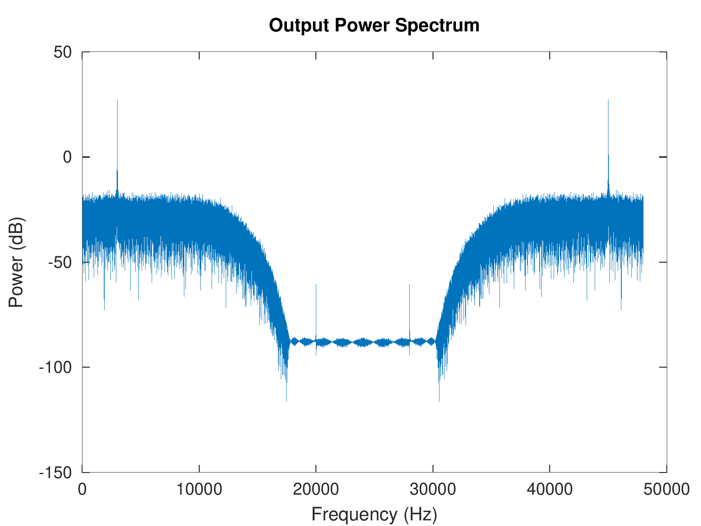
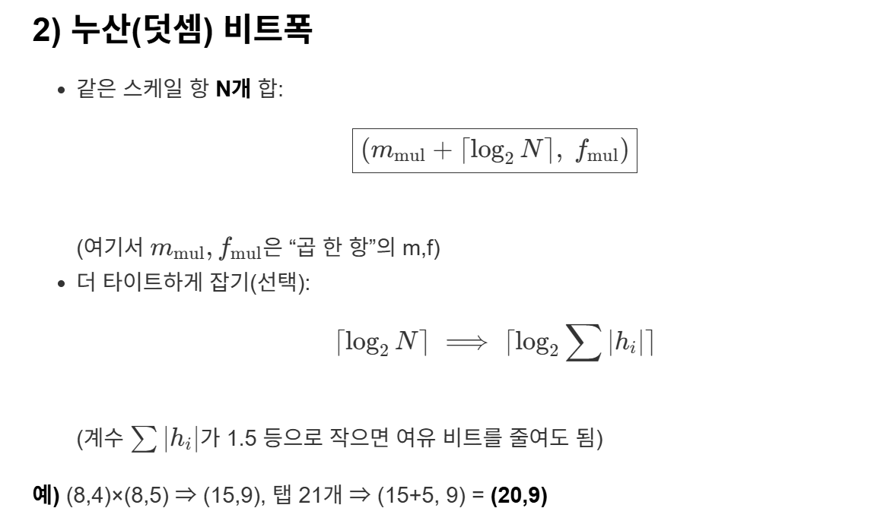
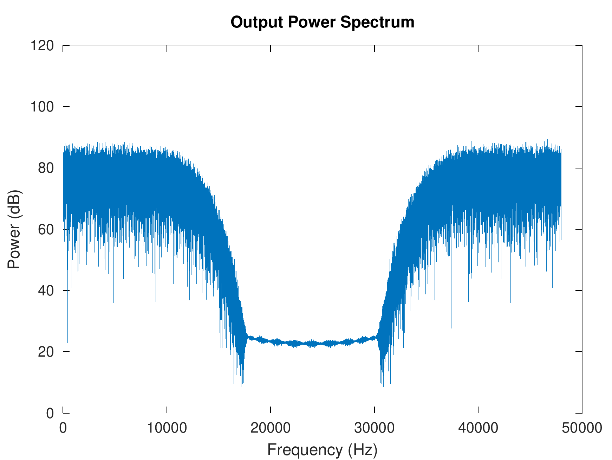

# 컨볼루션

> 1. 시간차 입력과 커널의 MAC 연산
> 2. 유사도를 출력 (패턴인식 관점)
> 3. 원하는 주파수 성분만 filtering (DSP 관점)
>   - LPF: 노이즈 제거(blur)
>   - HPF: 엣지 검출(변화 강조)

## Filter 구현

- 길이 N인 커널 h[k] (N-tap Kernel; 시스템의 Impulse Response)
- 현재 입력과 이전 M-1 개의 입력을 저장하는 배열 x[n-k]
- Σ h(k)*x(n-k); [k = 0 ~ M-1] : MAC 연산
- **C 구현**: [Filter.c](./filter.c)


### 검증 (Octave)
- output.txt 파일을 gnu-octave를 사용하여 검증
- **구현**: [spectrum.m](test/spectrum.m)



# Fixed-Point로 구현


---


---



---

### 3) 라운딩 & 클램핑(=포화)

> 목적: 컨볼루션(MAC 연산) 결과를 **목표 소수 f_out**으로 내리면서  
> 품질 손실을 최소화(라운딩)하고, **표현 범위 밖** 값은 양끝에 붙여 안전화(포화=클램핑)한다.

```c
out = (out+(1<<15)) >> 16;   // out: 정수형
if(out > 32767) out = 32767; // 1 << 15 = 32768
else if(out < -32767) out = -32767;
```

- **C 구현**: [filter_fixed.c](test/filter_fixed.c)
- **Verilog 구현**: 
  - [filter.v](test/filter.v)
  - [top_filter.sv](test/top_filter.sv)

