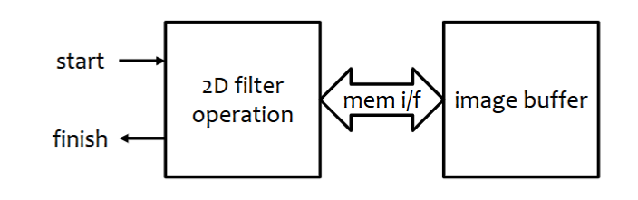
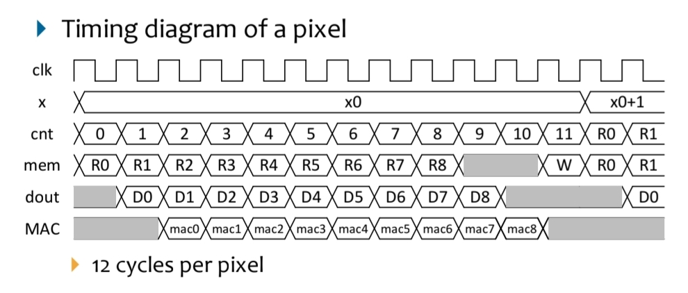
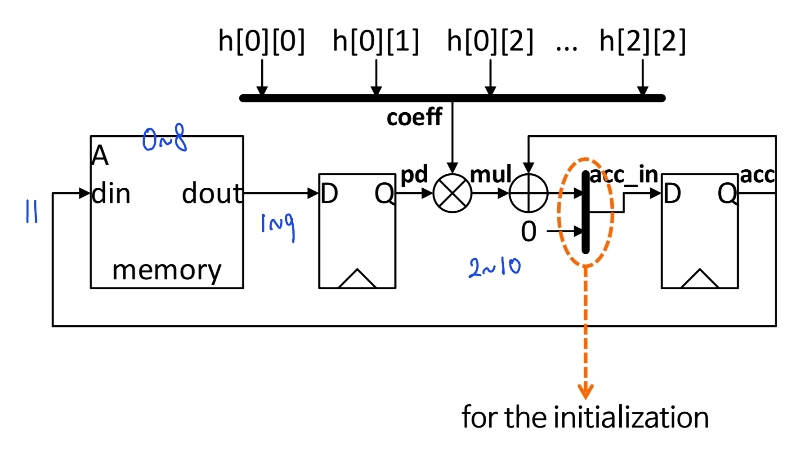
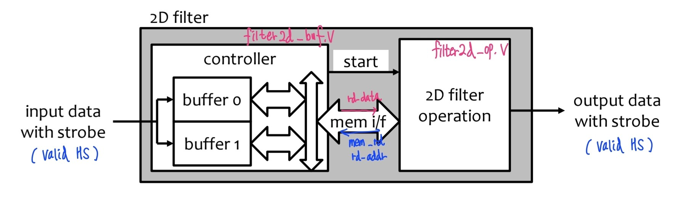

# Filter2D

## 1. Naive-Buffer

<table>
<tr>
 <td></td>
 <td></td>
</tr>
</table>

- Memory Map 방식으로 Read/Write
  - **MEM1:** 0 ~ WIDTH*WIDTH-1
  - **MEM2:** WIDTH*WIDTH ~ 2*WIDTH*WIDTH - 1
- test 전, **readmemh**를 통해 **img_in.dat**를 MEM1에 저장(dump)
- tb에서 start 펄스를 주면 filter2d.v의 연산 수행 결과를 MEM2에 저장
    - `wr_addr = ( cnt_y * WIDTH + cnt_x ) + WIDTH*WIDTH;`
- finish를 받으면 **img_out.dat** 생성 

### 2D-Convolution (MAC)

- **0~8cycle**: IMG-Buffer에서 Read
- **1~9cycle**: pd-register에 입력
- **2~10cycle**: MAC 연산 
- **11cycle**: IMG-Buffer에 Write

- **구현:**
  - [filter2d_v](filter2d_v/filter2d.v)
  - [tb_filter2d](filter2d_v/tb_filter2d.sv)

## 2. Double Buffer
> 복수 이미지 처리를 하는 경우, 새로운 데이터를 읽을 때 딜레이 문제에 대한 해법

- controller에서 값을 **읽는 버퍼**와 **처리하는 버퍼** 2개를 운영 (AREA 지불)
  - tb의 img_data에서 값을 읽은 버퍼는 다음 페이즈에 operator에 씀
  - 값을 쓴 버퍼는 다음 페이즈에 값을 읽음 (mode change) 
- 복수의 이미지 데이터를 딜레이 없이 처리할 수 있음

- **구현:**
  - [controller](filter2d_double_buf/buf_ctrl.v)
  - [operator](filter2d_double_buf/filter2d_op.v)
  - [tb](filter2d_double_buf/tb.v)

## 3. Line Buffer
> AREA COST를 최소화 하도록, 값을 읽는 중에도 처리하자 (Circular Buffer)
> 이미 읽은 데이터는 재사용하자 

