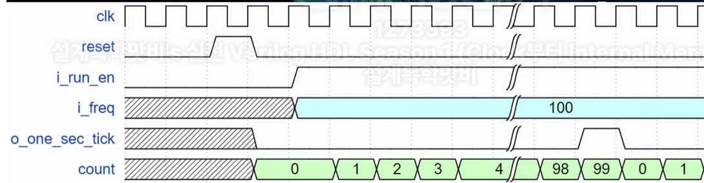
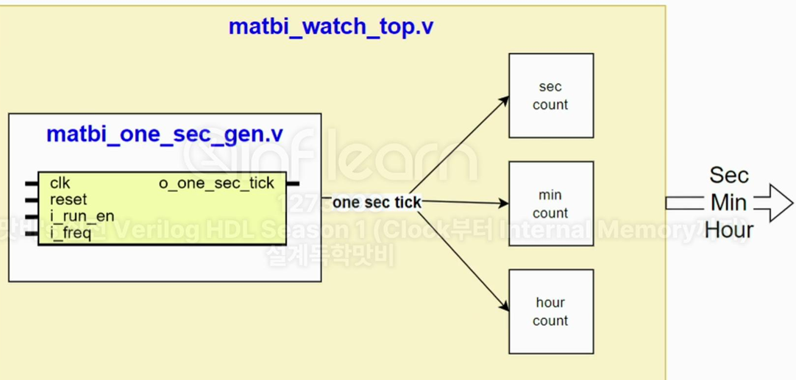
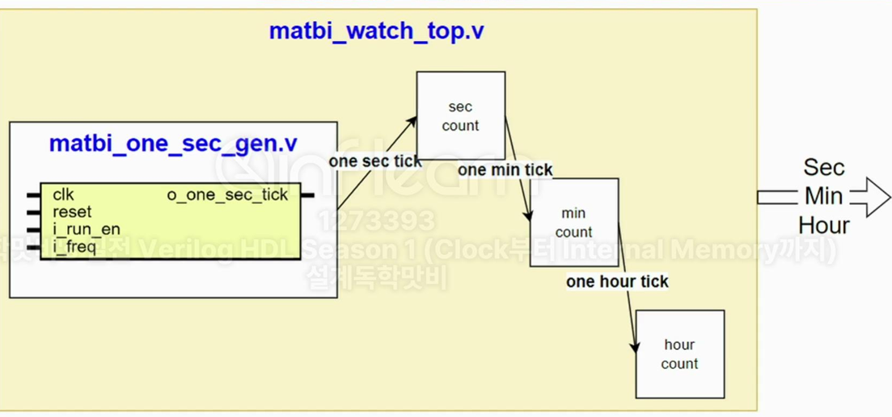
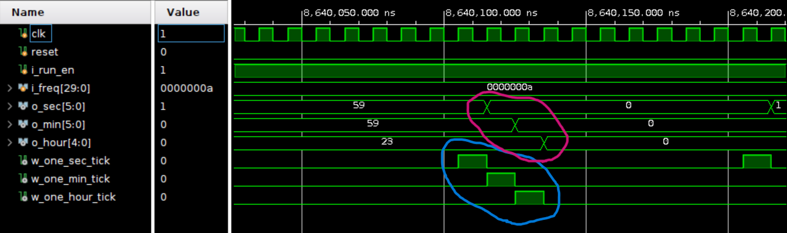
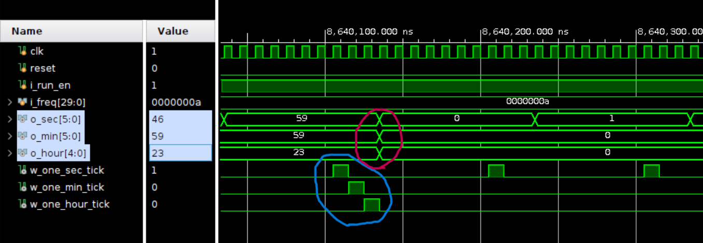

# Clock

## One Sec



## Parellel Style



```verilog
always@(posedge clk or negedge rstn) begin
  if(~rstn) begin
    sec_cnt <= 0;
    min_cnt <= 0;
    hour_cnt <= 0;
  end
  else if (sec1) begin
    if(sec_th) begin
      sec_cnt <= 0;
      if(min_th) begin
        min_cnt <= 0;
        hour_cnt <= hour_th ? 0 : hour_cnt + 1;
      end else begin
        min_cnt <= min_cnt + 1;
    end else begin
      sec_cnt <= sec_cnt + 1;
    end
  end
end
```

## Cascade Style



```verilog
always@(posedge clk or negedge rstn) begin
  if(~rstn) cnt <= 0;
  else if (i_tick) begin
    cnt <= 0;
    o_tick <= 1;
  end else begin
    cnt <= cnt + 1;
  end
end
```

### Cascade Delay

<table>
<tr>
<th>delay_propagate</th>
<td></td>
</tr>
<tr>
<th>delay_arrange</th>
<td></td>
</tr>
</table>
