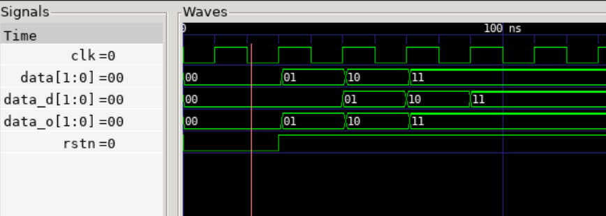
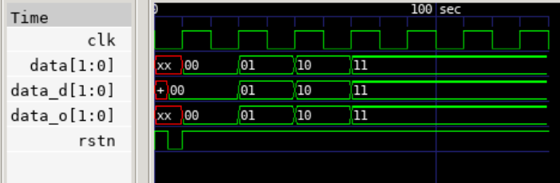

## Delay

```verilog
module test(
  input clk, rstn,
  input [1:0] data,
  output reg [1:0] data_d,
  output [1:0] data_o
);

always@(posedge clk or negedge rstn) begin
  if(~rstn) data_d <= 0;
  else data_d <= data;
end

assign data_o = data;
endmodule
```



- **data_o**는 assign 출력이고, **data_d**는 registered output이므로 위와 같이 1 클럭 딜레이된 출력을 기대한다.

```verilog
module tb_test;
reg clk, rstn;
reg [1:0] data, data_d, data_o;
test u_test (clk, rstn, data, data_d, data_o);

always #10 clk = ~clk;

initial begin
    $dumpfile("out.vvp");
    $dumpvars(0, tb_test);

    // 초기값 설정
    clk = 0;
    rstn = 1'b1; #5;
    rstn = 1'b0; #5;
    rstn = 1'b1;
    @(posedge clk); data = 0;
    @(posedge clk); data = 1;
    @(posedge clk); data = 2;
    @(posedge clk); data = 3;

    #50;
    $finish;
end
endmodule
```

- 그러나 클럭 에지 이후 딜레이를 걸어주지 않으면 데이터가 갱신될때 클럭도 함께 튀는 **경합 조건(race-condition)** 이 발생하여, 다음과 같이 output reg가 마치 조합논리처럼 거동하는 오류가 일어난다.



- 이를 방지하기 위해 아래와 같이 **@(posedge clk) 이후 delay**를 넣는다.

```verilog
@(posedge clk); #2; data = 0;
@(posedge clk); #2; data = 1;
@(posedge clk); #2; data = 2;
@(posedge clk); #2; data = 3;
```
