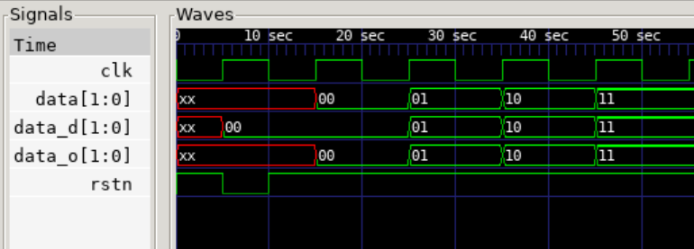

## Delay

```verilog
module test(
  input clk, rstn,
  input [1:0] data,
  output reg [1:0] data_d,
  output [1:0] data_o
);

always@(posedge clk or negedge rstn) begin
  if(~rstn) data_d <= 0;
  else data_d <= data;
end

assign data_o = data;
endmodule
```

- **data_o**는 assign 출력이고, **data_d**는 registered output이다.
  - assign은 지금 당장의 값을 반영한다면, **registered output**은 1-Cycle 동안의 안정된 상태를 반영한다.
  - **즉, registered output이란 edge 직전 1-Cycle동안 안정된 값을 출력하는 것**으로, 1 클럭 딜레이된 출력을 기대한다.

```verilog
module tb_test;
// ~~ I/O PORT & GEN CLK
initial begin
    // 초기값 설정
    clk = 0;
    rstn = 1'b1; #5;
    rstn = 1'b0; #5;
    rstn = 1'b1;
    @(posedge clk); data = 0;
    @(posedge clk); data = 1;
    @(posedge clk); data = 2;
    @(posedge clk); data = 3;
    #50;
    $finish;
end
endmodule
```

- 그러나 위와 같이 클럭 에지 이후 딜레이를 걸어주지 않으면 데이터가 갱신될때 클럭도 함께 튀는 **경합 조건(race-condition)** 이 발생하여, **좌측**과 같이 output reg가 마치 조합논리처럼 거동하는 오류가 일어난다.

<table>
<td text-align="left"></td>
<td text-align="right"></td>
</table>

- 이를 방지하기 위해 다음과 같이 **@(posedge clk) 이후 delay**를 넣으면, **우측**의 결과를 얻는다.

```verilog
@(posedge clk); #2; data = 0;
@(posedge clk); #2; data = 1;
@(posedge clk); #2; data = 2;
@(posedge clk); #2; data = 3;
```
