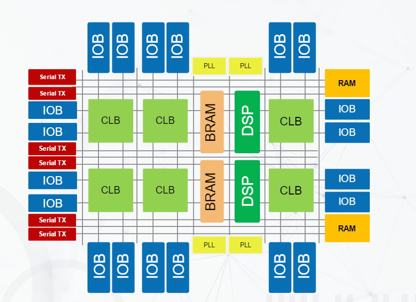
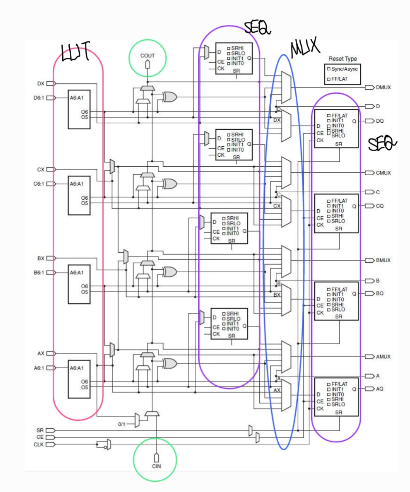
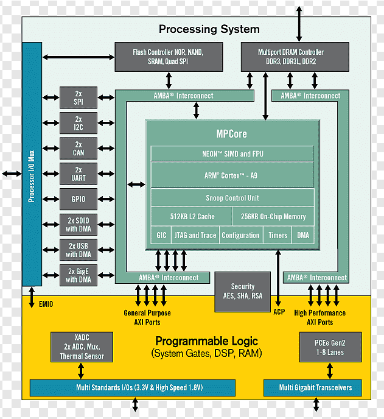

## Field Programmable Gate Array

> 프로그램에 필요한 Block들만을 **선택적으로 On/Off 하여 사용**할 수 있기 때문에 FPGA를 **Re-programmable** 하다고 하며, 이로 인해 **Multiple-Bitstream**이 가능하고 **Low Bug Fix Cost**의 이점을 얻음

### < Essentials (General) >

**1. CLB: Configurable Logic Block**

<table>
<tr>
<th>FPGA Structure</th>
<td text-align="left">

</td>
<th>CLB Structure</th>
<td text-align="right">

</td>
</tr>
</table>

- **LUT :** Combinational 연산을 지원하기 위한 Look Up Table
- **Carry Logic :** ALU를 지원하기 위한 로직; LUT AREA를 최소화하는 용도
- **Sequential Element**
- **Mux**

**2. IOB (Input/Output Buffer) :** 외부 소자들과 통신하기 위한 버퍼
**3. Programmable Interconnect (Vertical/Horizontal Routing Channel) :** 라우팅 경로를 최적화 하기 위해

### < Dedicated Block (Specific) >

> Essential Block만으로 동작은 하지만, PPA가 구리기 때문에 이를 최적화 하기 위해 추가되는 Block

- **BRAM**
- **DSP**
- **PLL**
- **Serial Tx**

---

## PS/PL

-
